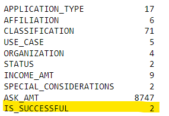
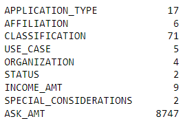
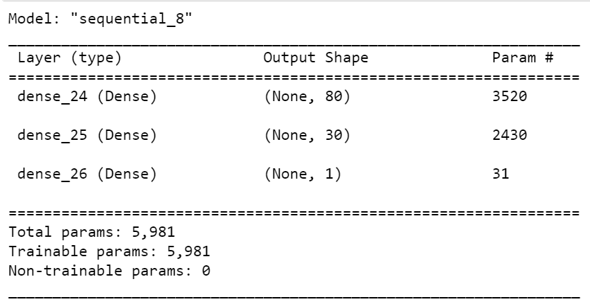
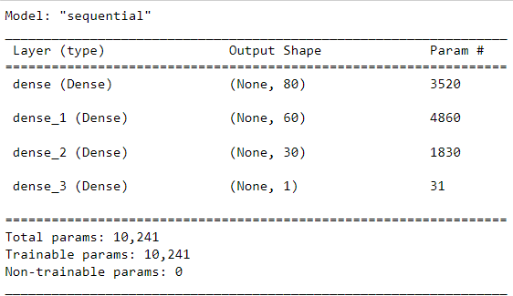

# Neural_Network_Charity_Analysis

## 1. Overview of the analysis:

    With your knowledge of machine learning and neural networks, we would like to use features in the provided dataset to help Beks create a binary classifier that is capable of predicting whether applicants will be successful if funded by Alphabet Soup.

    From Alphabet Soup’s business team, Beks obtained a CSV file  more than 34,000 organizations that have received funding from Alphabet Soup over the years. On base of available data we will going to find out the how fund receiver is successful!

## 2. Results:
    Following steps are followed during the analysis:

    *   Data Preprocessing:
            
        IS_SUCCESSFUL variable is considered  as target for this model.
 

        Following variables are considered as features for this model.

        We have removed "EIN" and "NAME" columns as these columns are not usefull in analysis. 

    * Compiling, Training, and Evaluating the Model:

        * We have selected two hidden layers.
        * 80 neurons are selected for first layer with "relu" activation function.
        * we have tried 30 neuron for second layer with "relu" activation function.
        * with above mentioned parameters we have observed 48.11% accracy.

    * Optimization:

        
        * with help of additional hidden layer we can elevated up to 0.6865 accuracy achieved.
        * following steps are taken to increase accuracy in model performance.

            1.  Increase the additional hidden layer and observed improvement from 48.11% to 68.65% accuracy.
            2. We have tried different activation function such as "relu", "tanh" & "sigmoid".
            3. We have also change the # of epoch to see any it make any improvement in accuracy but we have not seen any improvement with epoch increase.

##  3. Summary:
        * We have process the model with different parameters and observed the variation from one test to another.
        * change in the # of hidden layers will significatnly effect in the accuracy as well as processing time.
        * with changing different parameter we have observed increase in accuracy from 48.11% to 68.65%.

